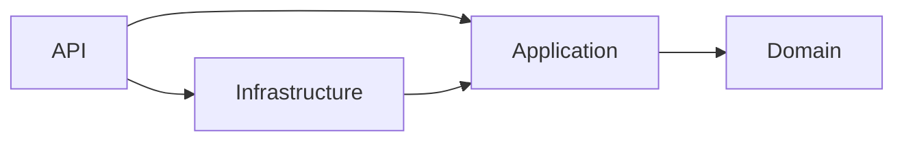

# Practice Exercise — Part 1: Domain & Infrastructure

> **📌 How to use this document**
> This is **Doc 1 of 2**. Work through it **first**, top to bottom, before opening `02-api-auth-docker.md`.
> Goal of this phase: build the bottom layers of Clean Architecture (Domain → Application → Infrastructure) for a **Social Network API**, with the Repository Pattern and EF Core Code-First migrations, and prove they work (migrations apply, DB tables are created) **before** you touch controllers, JWT, or Docker.
> Do not start Doc 2 until every checkbox in the "Phase Checklist" at the bottom is checked.

---

## 0. Solution Structure

Create a solution with 4 projects, following the same layering you used in the Warehouse course:

```
SocialNetwork.sln
├── src/
│   ├── SocialNetwork.Domain/          (class library — no dependencies)
│   ├── SocialNetwork.Application/     (class library — depends on Domain)
│   ├── SocialNetwork.Infrastructure/  (class library — depends on Application + Domain, EF Core, SQL Server)
│   └── SocialNetwork.API/             (ASP.NET Core Web API — depends on Application + Infrastructure)
```

Dependency rule (must be enforced):



- `Domain` references **nothing** (no EF Core, no ASP.NET packages). Pure C# entities + interfaces.
- `Application` references `Domain` only, plus lightweight packages (AutoMapper, FluentValidation if you choose to use them).
- `Infrastructure` references `Application`/`Domain` + `Microsoft.EntityFrameworkCore.SqlServer`.
- `API` references `Application` + `Infrastructure` (composition root — this is where DI wiring happens in `Program.cs`).

**Checklist:**
- [ ] 4 projects created with `dotnet new classlib` / `dotnet new webapi`, added to a `.sln`
- [ ] Project references set up exactly per the diagram above (try to reference EF Core from `Domain` — it should feel wrong; don't do it)

---

## 1. Domain Layer — Entities

Namespace: `SocialNetwork.Domain.Entities`

Create the following entities. Keep them as **plain C# classes** (no data-annotations required here — validation/constraints belong in Infrastructure's Fluent API or Application's validators).

### `User`
| Property | Type | Notes |
|---|---|---|
| `Id` | `Guid` | PK |
| `Username` | `string` | unique |
| `Email` | `string` | unique |
| `PasswordHash` | `string` | never store plain text |
| `Bio` | `string?` | optional |
| `ProfilePictureUrl` | `string?` | optional |
| `CreatedAt` | `DateTime` | UTC |
| `Posts` | `ICollection<Post>` | navigation |
| `Comments` | `ICollection<Comment>` | navigation |
| `Following` | `ICollection<Follow>` | users this user follows |
| `Followers` | `ICollection<Follow>` | users following this user |

### `Post`
| Property | Type | Notes |
|---|---|---|
| `Id` | `Guid` | PK |
| `UserId` | `Guid` | FK → `User` (author) |
| `Content` | `string` | required, max length e.g. 2000 |
| `ImageUrl` | `string?` | optional |
| `CreatedAt` | `DateTime` | UTC |
| `UpdatedAt` | `DateTime?` | set on edit |
| `Comments` | `ICollection<Comment>` | navigation |
| `Likes` | `ICollection<Like>` | navigation |

### `Comment`
| Property | Type | Notes |
|---|---|---|
| `Id` | `Guid` | PK |
| `PostId` | `Guid` | FK → `Post` |
| `UserId` | `Guid` | FK → `User` (author) |
| `Content` | `string` | required, max length e.g. 500 |
| `CreatedAt` | `DateTime` | UTC |

### `Like`
| Property | Type | Notes |
|---|---|---|
| `Id` | `Guid` | PK |
| `PostId` | `Guid` | FK → `Post` |
| `UserId` | `Guid` | FK → `User` |
| `CreatedAt` | `DateTime` | UTC |
| — | — | **Business rule:** a user can like a given post at most once (unique pair `PostId`+`UserId`) |

### `Follow` (self-referencing many-to-many on `User`)
| Property | Type | Notes |
|---|---|---|
| `Id` | `Guid` | PK |
| `FollowerId` | `Guid` | FK → `User` (the one who follows) |
| `FollowingId` | `Guid` | FK → `User` (the one being followed) |
| `CreatedAt` | `DateTime` | UTC |
| — | — | **Business rule:** unique pair `FollowerId`+`FollowingId`; `FollowerId != FollowingId` (a user cannot follow themselves) |

**Checklist:**
- [ ] All 5 entities created in `SocialNetwork.Domain.Entities`
- [ ] No EF Core / data-annotation attributes used in this layer
- [ ] Navigation properties added where noted above

---

## 2. Domain Layer — Repository Interfaces

Namespace: `SocialNetwork.Domain.Interfaces` (or `Repositories`)

```csharp
public interface IRepository<T> where T : class
{
    Task<T?> GetByIdAsync(Guid id);
    Task<IEnumerable<T>> GetAllAsync();
    Task AddAsync(T entity);
    void Update(T entity);
    void Remove(T entity);
}
```

Add specific repository interfaces that extend the generic one with domain-specific queries:

```csharp
public interface IUserRepository : IRepository<User>
{
    Task<User?> GetByUsernameAsync(string username);
    Task<User?> GetByEmailAsync(string email);
    Task<bool> ExistsAsync(string username, string email);
}

public interface IPostRepository : IRepository<Post>
{
    Task<IEnumerable<Post>> GetFeedForUserAsync(Guid userId, int page, int pageSize);
    Task<IEnumerable<Post>> GetByUserIdAsync(Guid userId);
}

public interface ICommentRepository : IRepository<Comment>
{
    Task<IEnumerable<Comment>> GetByPostIdAsync(Guid postId);
}

public interface ILikeRepository : IRepository<Like>
{
    Task<Like?> GetAsync(Guid postId, Guid userId);
    Task<int> CountForPostAsync(Guid postId);
}

public interface IFollowRepository : IRepository<Follow>
{
    Task<Follow?> GetAsync(Guid followerId, Guid followingId);
    Task<IEnumerable<Guid>> GetFollowingIdsAsync(Guid userId);
    Task<IEnumerable<User>> GetFollowersAsync(Guid userId);
    Task<IEnumerable<User>> GetFollowingAsync(Guid userId);
}
```

Add a **Unit of Work** interface to commit changes across repositories in one transaction:

```csharp
public interface IUnitOfWork
{
    IUserRepository Users { get; }
    IPostRepository Posts { get; }
    ICommentRepository Comments { get; }
    ILikeRepository Likes { get; }
    IFollowRepository Follows { get; }
    Task<int> SaveChangesAsync();
}
```

**Checklist:**
- [ ] Generic `IRepository<T>` created
- [ ] 5 specific repository interfaces created with the extra query methods above
- [ ] `IUnitOfWork` created

---

## 3. Application Layer — DTOs

Namespace: `SocialNetwork.Application.DTOs`

Create request/response DTOs (records or classes) — **never expose entities directly from the API**. Minimum set:

- `RegisterRequestDto` (`Username`, `Email`, `Password`)
- `LoginRequestDto` (`Email`, `Password`)
- `AuthResponseDto` (`Token`, `Username`, `UserId`, `ExpiresAt`) — used in Doc 2
- `UserProfileDto` (`Id`, `Username`, `Bio`, `ProfilePictureUrl`, `FollowersCount`, `FollowingCount`)
- `CreatePostDto` (`Content`, `ImageUrl?`)
- `PostResponseDto` (`Id`, `AuthorUsername`, `Content`, `ImageUrl`, `CreatedAt`, `LikesCount`, `CommentsCount`)
- `CreateCommentDto` (`Content`)
- `CommentResponseDto` (`Id`, `AuthorUsername`, `Content`, `CreatedAt`)

> ⚠️ Keep these DTO names exactly as above — Doc 2 references `PostResponseDto` and the `AuthResponseDto`/JWT claims by these names so the two docs stay consistent.

**Checklist:**
- [ ] All DTOs above created in `SocialNetwork.Application.DTOs`

---

## 4. Application Layer — Service Interfaces

Namespace: `SocialNetwork.Application.Interfaces`

```csharp
public interface IUserService
{
    Task<UserProfileDto> GetProfileAsync(Guid userId);
    Task FollowAsync(Guid followerId, Guid followingId);
    Task UnfollowAsync(Guid followerId, Guid followingId);
    Task<IEnumerable<UserProfileDto>> GetFollowersAsync(Guid userId);
    Task<IEnumerable<UserProfileDto>> GetFollowingAsync(Guid userId);
}

public interface IPostService
{
    Task<PostResponseDto> CreateAsync(Guid userId, CreatePostDto dto);
    Task<PostResponseDto?> GetByIdAsync(Guid postId);
    Task<IEnumerable<PostResponseDto>> GetFeedAsync(Guid userId, int page, int pageSize);
    Task DeleteAsync(Guid postId, Guid requestingUserId);
}

public interface ICommentService
{
    Task<CommentResponseDto> AddAsync(Guid postId, Guid userId, CreateCommentDto dto);
    Task<IEnumerable<CommentResponseDto>> GetForPostAsync(Guid postId);
}

public interface ILikeService
{
    Task LikeAsync(Guid postId, Guid userId);
    Task UnlikeAsync(Guid postId, Guid userId);
}
```

Implement these as concrete classes (e.g., `UserService`, `PostService`, ...) in `SocialNetwork.Application.Services`, injecting `IUnitOfWork` (and `IMapper` if you use AutoMapper). Implementations live in Application because they only orchestrate domain/repository logic — no EF Core types should appear here.

**Business rules to enforce inside the services (not the controllers):**
- `PostService.DeleteAsync`: throw a domain/application exception (e.g., `ForbiddenException`) if `requestingUserId` is not the post's author.
- `LikeService.LikeAsync`: no-op or throw `ConflictException` if the like already exists.
- `UserService.FollowAsync`: throw if `followerId == followingId`, and no-op/throw if already following.

**Checklist:**
- [ ] 4 service interfaces created
- [ ] Concrete implementations created and injected with `IUnitOfWork`
- [ ] Business rules above implemented with clear, catchable exception types (you'll map these to HTTP status codes in Doc 2's global error handler)

---

## 5. Infrastructure Layer — DbContext & EF Configuration

Namespace: `SocialNetwork.Infrastructure.Persistence`

```csharp
public class AppDbContext : DbContext
{
    public AppDbContext(DbContextOptions<AppDbContext> options) : base(options) { }

    public DbSet<User> Users => Set<User>();
    public DbSet<Post> Posts => Set<Post>();
    public DbSet<Comment> Comments => Set<Comment>();
    public DbSet<Like> Likes => Set<Like>();
    public DbSet<Follow> Follows => Set<Follow>();

    protected override void OnModelCreating(ModelBuilder modelBuilder)
    {
        modelBuilder.ApplyConfigurationsFromAssembly(typeof(AppDbContext).Assembly);
    }
}
```

Create Fluent API configurations (`IEntityTypeConfiguration<T>`) — one file per entity, e.g. `UserConfiguration.cs`:

- **`UserConfiguration`**: unique index on `Username`, unique index on `Email`, max lengths.
- **`PostConfiguration`**: FK to `User` with `OnDelete(DeleteBehavior.Cascade)` (deleting a user deletes their posts), max length on `Content`.
- **`CommentConfiguration`**: FK to `Post` (cascade) and `User` (restrict, to avoid multiple cascade paths).
- **`LikeConfiguration`**: **unique composite index** on (`PostId`, `UserId`); FKs to `Post` (cascade) and `User` (restrict).
- **`FollowConfiguration`**: **unique composite index** on (`FollowerId`, `FollowingId`); both FKs point to `User` — configure both with `OnDelete(DeleteBehavior.Restrict)` (SQL Server will reject multiple cascade paths on self-referencing relationships otherwise).

> 💡 **Why `Restrict` on some FKs?** SQL Server does not allow more than one cascade path to the same table. Since `Follow` has two FKs to `User`, and `Like`/`Comment` already cascade from `Post`→`User` indirectly, you must set at least one FK per entity to `Restrict`/`NoAction` or `dotnet ef database update` will fail with a cascade cycle error. This is a common real-world EF Core gotcha — expect it and don't panic if you hit it.

**Checklist:**
- [ ] `AppDbContext` created with all 5 `DbSet`s
- [ ] 5 entity configuration classes created
- [ ] Unique constraints in place for: `User.Username`, `User.Email`, `Like(PostId,UserId)`, `Follow(FollowerId,FollowingId)`
- [ ] Cascade-cycle issue resolved (at least one FK per multi-path relationship set to `Restrict`)

---

## 6. Infrastructure Layer — Repository & Unit of Work Implementations

Namespace: `SocialNetwork.Infrastructure.Repositories`

- Implement a generic `Repository<T> : IRepository<T>` wrapping `AppDbContext.Set<T>()`.
- Implement each specific repository (`UserRepository`, `PostRepository`, `CommentRepository`, `LikeRepository`, `FollowRepository`) inheriting from the generic base and adding the extra query methods (use LINQ + `Include()` for navigation properties, e.g. `PostRepository.GetFeedForUserAsync` should join against the `Follow` table to only return posts from followed users, ordered by `CreatedAt desc`, with paging via `Skip`/`Take`).
- Implement `UnitOfWork : IUnitOfWork` that constructs each repository from the same `AppDbContext` instance and exposes `SaveChangesAsync()`.

**Checklist:**
- [ ] Generic `Repository<T>` implemented
- [ ] All 5 specific repositories implemented
- [ ] `UnitOfWork` implemented and calls `_context.SaveChangesAsync()`

---

## 7. EF Core Code-First Migrations

From the `SocialNetwork.Infrastructure` (or `API`, whichever is your EF Core startup project) directory:

```powershell
dotnet tool install --global dotnet-ef   # if not already installed
dotnet ef migrations add InitialCreate --project SocialNetwork.Infrastructure --startup-project SocialNetwork.API
dotnet ef database update --project SocialNetwork.Infrastructure --startup-project SocialNetwork.API
```

For this phase, run SQL Server locally (e.g., LocalDB, or `docker run -e "ACCEPT_EULA=Y" -e "SA_PASSWORD=YourStrong!Passw0rd" -p 1433:1433 -d mcr.microsoft.com/mssql/server:2022-latest`) — the full docker-compose setup for API+DB together comes in Doc 2. Put the connection string in `appsettings.Development.json` under `ConnectionStrings:DefaultConnection`.

**Checklist:**
- [ ] Migration `InitialCreate` generated with no errors
- [ ] `dotnet ef database update` succeeds against a local/dev SQL Server
- [ ] You can see all 5 tables (`Users`, `Posts`, `Comments`, `Likes`, `Follows`) in SSMS/Azure Data Studio with the expected unique indexes and FKs

---

## 8. Dependency Injection wiring (composition root preview)

In `SocialNetwork.API/Program.cs`, register (you'll expand this file further in Doc 2):

```csharp
builder.Services.AddDbContext<AppDbContext>(options =>
    options.UseSqlServer(builder.Configuration.GetConnectionString("DefaultConnection")));

builder.Services.AddScoped<IUnitOfWork, UnitOfWork>();
builder.Services.AddScoped<IUserService, UserService>();
builder.Services.AddScoped<IPostService, PostService>();
builder.Services.AddScoped<ICommentService, CommentService>();
builder.Services.AddScoped<ILikeService, LikeService>();
```

**Checklist:**
- [ ] `Program.cs` builds and runs (`dotnet run`) with no DI resolution errors — even with zero controllers yet, the app should start cleanly

---

## ✅ Phase Checklist (must all be true before opening Doc 2)

- [ ] Solution builds with 4 projects, dependency direction matches the diagram in section 0
- [ ] All 5 domain entities exist with correct navigation properties
- [ ] All repository + Unit of Work interfaces/implementations exist
- [ ] All DTOs from section 3 exist with the exact names listed
- [ ] All 4 application services implemented with the business rules from section 4
- [ ] `AppDbContext` + Fluent configurations enforce all 4 unique constraints listed in section 5
- [ ] `dotnet ef database update` runs successfully and all 5 tables exist in SQL Server
- [ ] `dotnet run` starts the (currently controller-less) API without DI errors

Once every box is checked, open **`02-api-auth-docker.md`** to build the REST API, add JWT authentication, Swagger, logging/error handling, and containerize everything with Docker.
