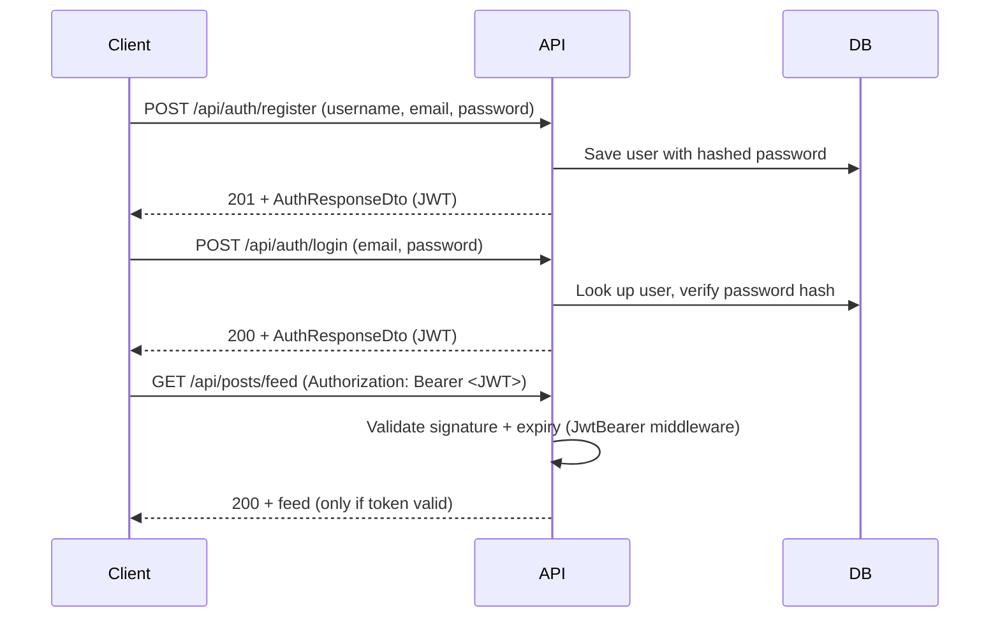

# Practice Exercise — Part 2: REST API, JWT Auth, Swagger, Logging & Docker

> **📌 How to use this document**
> This is **Doc 2 of 2**. Only start this **after every checkbox in `01-domain-and-infrastructure.md` is checked** — this phase builds the Presentation layer on top of the repositories/services you already built and tested.
> This doc also includes a **full JWT tutorial with code**, since you haven't used JWT before. Read the explanations, don't just copy the code — you'll be asked to reproduce it yourself.

---

## 1. REST API — Controllers & Routes

Namespace: `SocialNetwork.API.Controllers`. All controllers use `[ApiController]` + route prefix `api/[controller]`. Controllers must be **thin** — they call the Application services from Doc 1, they do not contain business logic.

| Controller | Verb | Route | Auth? | Description |
|---|---|---|---|---|
| `AuthController` | POST | `/api/auth/register` | ❌ | Create user, return `AuthResponseDto` |
| `AuthController` | POST | `/api/auth/login` | ❌ | Validate credentials, return `AuthResponseDto` |
| `UsersController` | GET | `/api/users/{id}` | ✅ | `UserProfileDto` |
| `UsersController` | POST | `/api/users/{id}/follow` | ✅ | current user follows `{id}` |
| `UsersController` | DELETE | `/api/users/{id}/follow` | ✅ | current user unfollows `{id}` |
| `UsersController` | GET | `/api/users/{id}/followers` | ✅ | list of `UserProfileDto` |
| `UsersController` | GET | `/api/users/{id}/following` | ✅ | list of `UserProfileDto` |
| `PostsController` | POST | `/api/posts` | ✅ | create post for current user |
| `PostsController` | GET | `/api/posts/{id}` | ✅ | single post |
| `PostsController` | GET | `/api/posts/feed?page=&pageSize=` | ✅ | feed = posts from followed users |
| `PostsController` | DELETE | `/api/posts/{id}` | ✅ | only author may delete (403 otherwise) |
| `CommentsController` | POST | `/api/posts/{postId}/comments` | ✅ | add comment |
| `CommentsController` | GET | `/api/posts/{postId}/comments` | ✅ | list comments |
| `LikesController` | POST | `/api/posts/{postId}/likes` | ✅ | like a post (idempotent / 409 if exists) |
| `LikesController` | DELETE | `/api/posts/{postId}/likes` | ✅ | unlike a post |

Status codes to use consistently: `200 OK` (reads), `201 Created` (POST that creates a resource — return `CreatedAtAction`), `204 No Content` (deletes), `400 Bad Request` (validation), `401 Unauthorized` (missing/invalid token), `403 Forbidden` (authenticated but not allowed, e.g. deleting someone else's post), `404 Not Found`, `409 Conflict` (duplicate like/follow).

**Checklist:**
- [ ] All controllers/routes above implemented, calling the Doc-1 services (no LINQ-to-DbContext code in controllers)
- [ ] Correct status codes returned per the table above

---

## 2. JWT Authentication — Full Tutorial

### 2.1 What is a JWT?

A **JSON Web Token** is a compact, self-contained way to represent identity between two parties. It's a string made of 3 base64url-encoded parts separated by dots:

```
xxxxx.yyyyy.zzzzz
header   .  payload  .  signature
```

- **Header** — algorithm + token type, e.g. `{"alg":"HS256","typ":"JWT"}`
- **Payload** — the **claims**: statements about the user, e.g. `{"sub":"user-guid","name":"alice","exp":1735689600}`. Not encrypted — anyone can decode and read it (don't put secrets here) — but it **is signed**, so it can't be tampered with undetected.
- **Signature** — `HMACSHA256(base64(header) + "." + base64(payload), secretKey)`. The server recomputes this on every request; if it doesn't match, the token is rejected.

**Why use it?** REST APIs are stateless — the server doesn't remember who you are between requests. Instead of a server-side session, the client sends the JWT in the `Authorization: Bearer <token>` header on every request, and the server verifies the signature to trust the claims inside without a DB lookup.

### 2.2 The flow you're building



### 2.3 Password hashing

**Never store plain-text passwords.** Use ASP.NET Core's built-in hasher (no extra NuGet package needed):

```csharp
// Registration
var hasher = new PasswordHasher<User>();
user.PasswordHash = hasher.HashPassword(user, request.Password);

// Login
var result = hasher.VerifyHashedPassword(user, user.PasswordHash, request.Password);
if (result == PasswordVerificationResult.Failed)
    throw new UnauthorizedException("Invalid credentials");
```

### 2.4 Generating the token — `ITokenService`

Add NuGet package to `SocialNetwork.Infrastructure`: `Microsoft.AspNetCore.Authentication.JwtBearer` and `System.IdentityModel.Tokens.Jwt`.

```csharp
// SocialNetwork.Application/Interfaces/ITokenService.cs
public interface ITokenService
{
    string GenerateToken(Guid userId, string username, out DateTime expiresAt);
}
```

```csharp
// SocialNetwork.Infrastructure/Auth/TokenService.cs
using System.IdentityModel.Tokens.Jwt;
using System.Security.Claims;
using System.Text;
using Microsoft.IdentityModel.Tokens;

public class TokenService : ITokenService
{
    private readonly IConfiguration _config;

    public TokenService(IConfiguration config) => _config = config;

    public string GenerateToken(Guid userId, string username, out DateTime expiresAt)
    {
        var claims = new[]
        {
            new Claim(ClaimTypes.NameIdentifier, userId.ToString()),
            new Claim(ClaimTypes.Name, username),
            new Claim(JwtRegisteredClaimNames.Jti, Guid.NewGuid().ToString())
        };

        var key = new SymmetricSecurityKey(Encoding.UTF8.GetBytes(_config["Jwt:Key"]!));
        var creds = new SigningCredentials(key, SecurityAlgorithms.HmacSha256);

        expiresAt = DateTime.UtcNow.AddHours(2);

        var token = new JwtSecurityToken(
            issuer: _config["Jwt:Issuer"],
            audience: _config["Jwt:Audience"],
            claims: claims,
            expires: expiresAt,
            signingCredentials: creds);

        return new JwtSecurityTokenHandler().WriteToken(token);
    }
}
```

Add config to `appsettings.json` (use a long random string for `Key`, at least 32 characters — this is your HMAC signing secret, keep it out of source control in real projects via user-secrets/env vars):

```json
"Jwt": {
  "Key": "REPLACE_WITH_A_LONG_RANDOM_SECRET_AT_LEAST_32_CHARS",
  "Issuer": "SocialNetwork.API",
  "Audience": "SocialNetwork.Client"
}
```

### 2.5 Wiring authentication into `Program.cs`

```csharp
using Microsoft.AspNetCore.Authentication.JwtBearer;
using Microsoft.IdentityModel.Tokens;
using System.Text;

var jwtKey = builder.Configuration["Jwt:Key"]!;

builder.Services.AddAuthentication(JwtBearerDefaults.AuthenticationScheme)
    .AddJwtBearer(options =>
    {
        options.TokenValidationParameters = new TokenValidationParameters
        {
            ValidateIssuer = true,
            ValidateAudience = true,
            ValidateLifetime = true,
            ValidateIssuerSigningKey = true,
            ValidIssuer = builder.Configuration["Jwt:Issuer"],
            ValidAudience = builder.Configuration["Jwt:Audience"],
            IssuerSigningKey = new SymmetricSecurityKey(Encoding.UTF8.GetBytes(jwtKey))
        };
    });

builder.Services.AddAuthorization();
builder.Services.AddScoped<ITokenService, TokenService>();

// ... after var app = builder.Build();
app.UseAuthentication();   // must come before UseAuthorization
app.UseAuthorization();
```

> ⚠️ Order matters: `UseAuthentication()` before `UseAuthorization()`, and both before `MapControllers()`.

### 2.6 Protecting endpoints & reading the current user

```csharp
[Authorize]
[ApiController]
[Route("api/posts")]
public class PostsController : ControllerBase
{
    private Guid CurrentUserId =>
        Guid.Parse(User.FindFirstValue(ClaimTypes.NameIdentifier)!);

    [HttpPost]
    public async Task<IActionResult> Create(CreatePostDto dto)
    {
        var result = await _postService.CreateAsync(CurrentUserId, dto);
        return CreatedAtAction(nameof(GetById), new { id = result.Id }, result);
    }
}
```

Put `[Authorize]` on the controller (applies to all actions) and `[AllowAnonymous]` only on `AuthController`'s `Register`/`Login` actions (or leave `AuthController` without `[Authorize]` entirely since it's a separate controller).

### 2.7 (Conceptual only — do not implement) Refresh tokens

Access tokens above expire in 2 hours; when they expire the user must log in again. Production systems issue a long-lived **refresh token** (stored server-side or as an HttpOnly cookie) that can be exchanged for a new access token without re-entering a password. This is **out of scope** for this practice — just be aware it's the next thing to learn after this exercise.

**Checklist:**
- [ ] `TokenService` implemented and registered in DI
- [ ] `AuthController.Register`/`Login` hash/verify passwords and return a real JWT via `AuthResponseDto`
- [ ] `Program.cs` wires `AddAuthentication().AddJwtBearer(...)`, and `UseAuthentication()`/`UseAuthorization()` are in the right order
- [ ] All controllers except `AuthController` require `[Authorize]`
- [ ] `CurrentUserId` (or equivalent) reads the `NameIdentifier` claim correctly — verify by logging in and calling a protected endpoint

---

## 3. Swagger / OpenAPI with JWT support

By default Swagger UI has no way to send an `Authorization` header. Add a security definition so you get an "Authorize" button:

```csharp
builder.Services.AddSwaggerGen(options =>
{
    options.SwaggerDoc("v1", new OpenApiInfo { Title = "Social Network API", Version = "v1" });

    options.AddSecurityDefinition("Bearer", new OpenApiSecurityScheme
    {
        Name = "Authorization",
        Type = SecuritySchemeType.Http,
        Scheme = "bearer",
        BearerFormat = "JWT",
        In = ParameterLocation.Header,
        Description = "Enter your JWT token below (no 'Bearer ' prefix needed, Swagger adds it)."
    });

    options.AddSecurityRequirement(new OpenApiSecurityRequirement
    {
        {
            new OpenApiSecurityScheme
            {
                Reference = new OpenApiReference { Type = ReferenceType.SecurityScheme, Id = "Bearer" }
            },
            Array.Empty<string>()
        }
    });
});
```

**Checklist:**
- [ ] Swagger UI shows an "Authorize" button
- [ ] Pasting a JWT from `/api/auth/login` into it lets you successfully call a protected endpoint from the Swagger page

---

## 4. Logging (Serilog) & Global Error Handling

### 4.1 Serilog setup

Add packages: `Serilog.AspNetCore`, `Serilog.Sinks.Console`, `Serilog.Sinks.File`.

```csharp
// top of Program.cs, before builder.Build()
Log.Logger = new LoggerConfiguration()
    .MinimumLevel.Information()
    .WriteTo.Console()
    .WriteTo.File("logs/log-.txt", rollingInterval: RollingInterval.Day)
    .Enrich.FromLogContext()
    .CreateLogger();

builder.Host.UseSerilog();
```

Log at minimum: every request (Serilog's `UseSerilogRequestLogging()` middleware gives you this for free), and every unhandled exception (next section).

### 4.2 Global exception handling (.NET 8 `IExceptionHandler`)

Instead of try/catch in every controller action, centralize it:

```csharp
public class GlobalExceptionHandler : IExceptionHandler
{
    private readonly ILogger<GlobalExceptionHandler> _logger;
    public GlobalExceptionHandler(ILogger<GlobalExceptionHandler> logger) => _logger = logger;

    public async ValueTask<bool> TryHandleAsync(
        HttpContext httpContext, Exception exception, CancellationToken cancellationToken)
    {
        _logger.LogError(exception, "Unhandled exception");

        var (statusCode, title) = exception switch
        {
            NotFoundException => (StatusCodes.Status404NotFound, "Resource not found"),
            ForbiddenException => (StatusCodes.Status403Forbidden, "Forbidden"),
            ConflictException => (StatusCodes.Status409Conflict, "Conflict"),
            ValidationException => (StatusCodes.Status400BadRequest, "Validation failed"),
            UnauthorizedException => (StatusCodes.Status401Unauthorized, "Unauthorized"),
            _ => (StatusCodes.Status500InternalServerError, "An unexpected error occurred")
        };

        httpContext.Response.StatusCode = statusCode;
        await httpContext.Response.WriteAsJsonAsync(new
        {
            title,
            status = statusCode,
            detail = exception.Message
        }, cancellationToken);

        return true;
    }
}
```

Register it:

```csharp
builder.Services.AddExceptionHandler<GlobalExceptionHandler>();
builder.Services.AddProblemDetails();
// ...
app.UseExceptionHandler();
```

Define the small custom exception types referenced above (`NotFoundException`, `ForbiddenException`, `ConflictException`, `UnauthorizedException`) in `SocialNetwork.Application.Exceptions` — these are the ones your Doc-1 services should throw for the business rules (duplicate like, follow yourself, delete someone else's post, etc.).

**Checklist:**
- [ ] Serilog logs to console + rolling file, request logging enabled
- [ ] `GlobalExceptionHandler` registered and returns consistent JSON `{title, status, detail}` for each custom exception type
- [ ] Triggering each business rule (e.g., double-like, deleting another user's post) returns the correct status code + JSON body, not an unhandled 500 stack trace

---

## 5. Docker — API + SQL Server via docker-compose

### 5.1 `Dockerfile` (multi-stage, place at repo root or `SocialNetwork.API/Dockerfile`)

```dockerfile
FROM mcr.microsoft.com/dotnet/sdk:8.0 AS build
WORKDIR /src
COPY . .
RUN dotnet restore "SocialNetwork.sln"
RUN dotnet publish "src/SocialNetwork.API/SocialNetwork.API.csproj" -c Release -o /app/publish

FROM mcr.microsoft.com/dotnet/aspnet:8.0 AS final
WORKDIR /app
COPY --from=build /app/publish .
EXPOSE 8080
ENTRYPOINT ["dotnet", "SocialNetwork.API.dll"]
```

### 5.2 `docker-compose.yml` (repo root)

```yaml
version: "3.9"

services:
  sqlserver:
    image: mcr.microsoft.com/mssql/server:2022-latest
    container_name: socialnetwork-sqlserver
    environment:
      ACCEPT_EULA: "Y"
      SA_PASSWORD: "YourStrong!Passw0rd"
    ports:
      - "1433:1433"
    volumes:
      - sqlserver-data:/var/opt/mssql
    healthcheck:
      test: ["CMD-SHELL", "/opt/mssql-tools/bin/sqlcmd -S localhost -U sa -P \"YourStrong!Passw0rd\" -Q 'SELECT 1' || exit 1"]
      interval: 10s
      timeout: 5s
      retries: 10

  api:
    build:
      context: .
      dockerfile: src/SocialNetwork.API/Dockerfile
    container_name: socialnetwork-api
    depends_on:
      sqlserver:
        condition: service_healthy
    environment:
      ASPNETCORE_ENVIRONMENT: "Docker"
      ConnectionStrings__DefaultConnection: "Server=sqlserver;Database=SocialNetworkDb;User Id=sa;Password=YourStrong!Passw0rd;TrustServerCertificate=True"
      Jwt__Key: "REPLACE_WITH_A_LONG_RANDOM_SECRET_AT_LEAST_32_CHARS"
      Jwt__Issuer: "SocialNetwork.API"
      Jwt__Audience: "SocialNetwork.Client"
    ports:
      - "8080:8080"

volumes:
  sqlserver-data:
```

Notes:
- The `api` service connects to `sqlserver` **by service name** (`Server=sqlserver`), not `localhost` — Docker Compose puts both containers on the same network and resolves service names via DNS.
- `depends_on.condition: service_healthy` ensures the API container doesn't start until SQL Server is actually accepting connections (a plain `depends_on` only waits for the container to start, not the DB to be ready).
- Never commit real passwords/keys like these to source control for anything beyond local practice — use `.env` files (git-ignored) or secrets management in real projects.

### 5.3 Applying EF Core migrations against the containerized DB

Two common approaches — pick one:

1. **Apply automatically on startup** (simplest for practice): in `Program.cs`, after `var app = builder.Build();`, add:
   ```csharp
   using (var scope = app.Services.CreateScope())
   {
       var db = scope.ServiceProvider.GetRequiredService<AppDbContext>();
       db.Database.Migrate();
   }
   ```
2. **Apply manually from your host machine** against the exposed port 1433:
   ```powershell
   dotnet ef database update --project SocialNetwork.Infrastructure --startup-project SocialNetwork.API --connection "Server=localhost,1433;Database=SocialNetworkDb;User Id=sa;Password=YourStrong!Passw0rd;TrustServerCertificate=True"
   ```

**Checklist:**
- [ ] `docker compose up --build` starts both containers successfully
- [ ] API container waits for SQL Server health check before starting
- [ ] Migrations applied (tables exist) inside the containerized `SocialNetworkDb`
- [ ] Swagger reachable at `http://localhost:8080/swagger` with the containerized stack running

---

## ✅ Final End-to-End Acceptance Checklist

Run these against the dockerized stack (`docker compose up --build`) via Swagger or curl/Postman, in order:

- [ ] `POST /api/auth/register` → `201` with a JWT in the response
- [ ] `POST /api/auth/login` → `200` with a JWT
- [ ] Paste the JWT into Swagger's "Authorize" button
- [ ] `POST /api/posts` (authenticated) → `201`, post created
- [ ] Register a second user, `POST /api/users/{id}/follow` (user 2 follows user 1)
- [ ] `GET /api/posts/feed` as user 2 → contains user 1's post
- [ ] `POST /api/posts/{id}/likes` twice as the same user → second call returns `409 Conflict` with the JSON error shape from section 4.2
- [ ] `DELETE /api/posts/{id}` as a *different* user than the author → `403 Forbidden`
- [ ] Check `logs/log-*.txt` (or container logs via `docker logs socialnetwork-api`) — requests and the above errors are all logged
- [ ] Calling any protected endpoint **without** a token → `401 Unauthorized`

When all boxes across **both** documents are checked, you've reproduced the full Clean Architecture + Repository Pattern + EF Core + JWT + Docker stack from the course on a brand-new domain — that's the practice complete.
